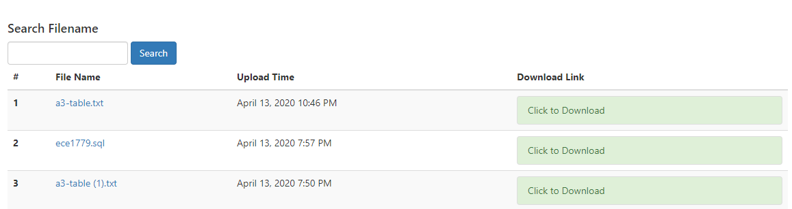

# Final Report
<a href="https://kaixuan0623.github.io/ECE1779-Final-Project/">view</a>
## Introduction
Filestagram is a lightweight file sharing and social media platform. Its name comes from "file" and "Instagram", as we can share not only our exciting moments with photos, as well as any types of files, and they are public to everyone. Except for uploading files, you can do the same thing as you do on other social media platforms, like following other users, commenting on any files, and editing your profiles. 

## How to use
Users can use our application without an account, they can see all the photos posted by other users on the Home page.


Anonymous users can also share their files under the Share File section.


Once the user uploads the file that he wants to share, a download url will be generated so that the user can share the file by sharing the url to others (the corresponding wget and curl command will also be generated). However, the file will expire in 1 hour.


Once users sign up and login, they will get access to more functionalities of the application.
First, by clicking the photo, they can see the comment page for the photo. Users can post some comment to the photo and can check the comments posted by other users.


By clicking the Avatar of the author, users can check the personal page of the author and have the option to follow the author. Under the home page, users can only see the photo posted by the following users.


Once logged in, users can post a photo as well as sharing their thoughts about the photo under the Upload Image section. Also, under the Share File section, the file uploaded will not expire and can be downloaded under the All Files page.


Under the All Files page, users can search for the file that they want to download.




## Architecture
### General Architecture
```bash
Filestagram
├── app
│   ├── \_\_init\_\_.py
│   ├── auth
│   │   ├── \_\_init\_\_.py
│   │   ├── forms.py
│   │   └── views.py
│   ├── decorators.py
│   ├── dymodels.py
│   ├── main
│   │   ├── \_\_init\_\_.py
│   │   ├── errors.py
│   │   ├── forms.py
│   │   ├── pipeline.py
│   │   └── views.py
│   ├── models.py
│   ├── templates
│   │   ├── 403.html
│   │   ├── 404.html
│   │   ├── 500.html
│   │   ├── _comments.html
│   │   ├── _macros.html
│   │   ├── _posts.html
│   │   ├── auth
│   │   │   ├── changePassword.html
│   │   │   ├── email
│   │   │   │   ├── resetPassword.html
│   │   │   │   └── resetPassword.txt
│   │   │   ├── login.html
│   │   │   └── register.html
│   │   ├── authTemplate.html
│   │   ├── base.html
│   │   ├── comments.html
│   │   ├── editPost.html
│   │   ├── editProfile.html
│   │   ├── file.html
│   │   ├── files.html
│   │   ├── followers.html
│   │   ├── index.html
│   │   ├── post.html
│   │   ├── upload.html
│   │   ├── uploadFile.html
│   │   └── user.html
│   ├── uploads
│   │   ├── files
│   │   ├── photos
│   │   └── user
│   └── utils
│       ├──\ \__init\_\_.py
│       ├── aws_utils.py
│       └── utils.py
├── config.py
├── manage.py
├── requirements.txt
└── zappa_settings.json
```
#### Important Components
- config.py: configure database related variables and user related variables.
- manage.py: import app object initialized from app.\_\_init\_\_.py and start the website in development mode.
- zappa_settings.json: parameters required for Zaapa delopyment.
- app/\_\_init\_\_.py: initialize the Flask app object, initialize database object, login manager, and objects required for uploading files.
- app/models.py: contains the RDS tables class that specifies the tables in the database used to store user authentication information and following operations.
- app/dymodels.py: contains the DynamoDB tables class that specifies the tables in the database used to store user posts and comments.
- auth/form.py: contains FlaskForm objects required by authentication operations, including login, registration, and changing password.
- main/pipeline.py: processes images and general files, generate uuid as unique file names, 
create thumbnails, then upload the image on Amazon S3.
- main/forms.py: contains FlaskForm objects required by the main operations, including uploading files/images, editing profiles, and comment.
- view.py files in the project are responsible for rendering html pages for different URLs.
- utils/utils.py: defines utility functions including pagination, and the `CustomizeUploadSet()` class which deals with the images storage path for uploading.
- util/aws_utils.py: contains a class `AWS_session` to handle different operations of AWS, such as uploading files to S3, and getting URLs of objects in S3.

#### RDS Schema
The name of the database is ece1779a3, it contains three tables: 
1. `roles`: stores user role information for access control purposes, like User, Moderator, and Administrator.
2. `follows`: stores the followers of users, including follower_id, followed_id, and timestamp.
3. `users`: stores user information. Each user will have an unique id, username, email, location, about_me, member_since time, last_seen time, hashed password, profile image, and role. 'Followed' and 'followers' indicate its relationship with the `follows` table.
	During initialization (new user registration), the corresponding `role` record will also be created, and a random avatar will be generated as the profile image, with its URL stored in `image_url`.

#### DynamoDB Schema
Three DynamoDB tables are used in this app.
1. `UserFile`: stores the files information uploaded by users, including id (sort key), author_id (hash key), author, timestamp, s3_filename, and original_filename.
	Sepcifically, 
	- `s3_filename`: the name of the file stored in Amazon S3.
	- `original_filename`: the name of the original file uploaded.
2. `Comment`: stores the comment that users post. Each record will have an body, timestamp (sort key), author_id, author, and image_id (hash key).
3. `UserImage`: stores the images information uploaded by users, including id (sort key), title, author_id (hash key), timestamp, and three filenames.
	Specifically, 
	- `base_filename`: the name of the image stored in Amazon S3.
	- `original_filename`: the path of the original version of the image uploaded.
	- `thumbnail_filename`: the path of the thumbnail version of the image uploaded.
	- NOTE: the name for different versions of the image is the same, we distinguish them by putting them into different folders.

### Background Process
Two Lambda functions are designed for background cleanups, including `S3_cleanup` and `dynamodb_cleanup`. 
- `S3_cleanup`: Delete old files and images uploaded more than 7 days ago in S3 bucket, `1779a3file`, and return a list of filenames that are deleted.
- `dynamodb_cleanup`: Delete file and image records created more than 7 days ago in DynamoDB, `UserFile` and `UserImage`.

To implement the cleaning on a regular basis, we designed two rules in CloudWatch: `s3_automatic_cleanup` and `dynamoDB_automatic_cleanup`, triggering the above Lamdba functions every hour. The outputs and state codes are sent to CloudWatch Logs.

## Cost Model
### Assumptions
- The average number of users in a month: $N_u$
- The number of visits of a user in a month: 20
- The number of files/images uploaded by a user in a month: 10
- The size of each file/image: 10MB
- The average number of times of downloads by a user in a month: 20

### Price of S3
Each new user gets 5GB of Amazon S3 storage in the S3 Standard storage class; 20,000 GET Requests; 2,000 PUT, COPY, POST, or LIST Requests. 

Since files in S3 bucket 1779a3file get deleted after 7 days, it only stores 7 days of file and images uploaded by users. By the assumptions, 
- the number of files stored in S3: $N_u\times 10\times 7 / 30 \approx 2.33N_u$
- the average storage used in S3 = $2.33N_u \times 10\times / 1024 \approx 0.0228N_u GB$
- the approximate number of PUT, COPY, POST, LIST requests = $2.33N_u + 720$
- the approximate number of GET, SELECT, and all other requests = $N_u\times 20\times 10=200N_u$

Therefore, the approximate price of S3 is:

$$\max\{0, (0.0228N_u-5)\times0.023\} + \max\{0, ((2.33N_u+720)-2000)/1000\times0.005\} + \max\{0, (200N_u-20000)/1000\times0.0004\}$$

$$=\max\{0, 5.08\times10^{-4}N_u-0.115\} + \max\{0, 1.165\times10^{-5}N_u-0.0064\} + \max\{0, 2\times10^{-5}N_u-0.008\}$$

### Price of DynamoDB
Each user has a free tier of 25 GB of data storage, 2.5 million stream read requests from DynamoDB Streams, and 1 GB of data transfer out, aggregated across AWS services. Since the operations in DynamoDB and S3 are highly synchronized, we can approximate the price of DynamoDB as follows.

- Suppose each record in DynamoDB is 500 bytes, the price for data storage is $\max\{0, 0.25\times(2.33N_u\times500\times10^{-9}-25)\}$. 
- The price for read and write requests is $2.91\times10^{-6}N_u+9\times10^{-3}+\max\{0, 5N_u\times10^{-5}-0.625\}$

The total price of DynamoDB would be the summation of the above two numbers.

### Price of Lambda
#### Filestagram App
The Filestagram app is allocated 512MB of memory. It ran for an average of 20000ms when a user visited, and 100ms billed duration when ran in background every 4 minutes. The charges would be calculated as follows:
- The monthly compute price is $0.00001667 per GB-s and the free tier provides 400,000 GB-s.
- Total compute (seconds) = 20$N_u$ * 20 + 60 * 24 * 30 * 0.1 / 4 = 400$N_u$ + 1080 seconds
- Total compute (GB-s) = (400$N_u$ + 1080) * 512 / 1024 = 200N_u + 540 GB-s
- The monthly compute charges is $\max\{0, (200N_u+540)\times 1.667\times 10^{-5}\}$.

Monthly request charges:
The monthly request price is $0.20 per 1 million requests and the free tier provides 1M requests per month.

- Total requests – Free tier request = Monthly billable requests
- Total requests = $20N_u + 10800$
Monthly request charges is $\max\{0, (20N_u + 10800)\times 2 \times 10^{-7}\}$.

Total compute charges:
Total charges = $\max\{0, (3.33N_u+9)\times 10^{-7}\} + \max\{0, (4N_u+2160)\times 10^{-6}\}$

#### Background processes 
S3_cleanup and dynamodb_cleanup are allocated 128MB of memory, triggered by CloudWatch Event every hour: 24*30*2 = 1440 times/month, and it ran for 2000ms each time, the charges would be calculated as follows:
- The monthly compute price is $0.00001667 per GB-s and the free tier provides 400,000 GB-s.
- Total compute (seconds) = 1440 * (0.2sec) = 288 seconds
- Total compute (GB-s) = 288 * 128MB/1024 = 36 GB-s
- Since 36GB-s < 400,000 free tier GB-s
Monthly compute charges is $0.

Monthly request charges:
The monthly request price is $0.20 per 1 million requests and the free tier provides 1M requests per month.
- Total requests – Free tier request = Monthly billable requests
Since 1440 requests < 1M free tier requests
Monthly request charges is $0.

Total compute charges
Total charges = Compute charges + Request charges = $0 per month

### Conclusion
Suppose the average number of users in a month is $N_u, based on the above assumptions:
- Price of S3 $$ = \max\{0, 5.08\times10^{-4}N_u-0.115\} + \max\{0, 1.165\times10^{-5}N_u-0.0064\} + \max\{0, 2\times10^{-5}N_u-0.008\}$$
- Price of DynamoDB $$ = \max\{0, 2.91N_u\times10^{-7}-6.25\} + 2.91\times10^{-6}N_u+9\times10^{-3}+\max\{0, 5N_u\times10^{-5}-0.625\}$$
- Price of Lambda $$ = \max\{0, (3.33N_u+9)\times 10^{-7}\} + \max\{0, (4N_u+2160)\times 10^{-6}\}$$
- **Total charges = Price of S3 + Price of DynamoDB + Price of Lambda**

### Prediction
- Predict the cost after six months for 10 users: $0.19
- Predict the cost after six months for 1000 users: $32.22
- Predict the cost after six months for 1000000 users: $35809.23


 

